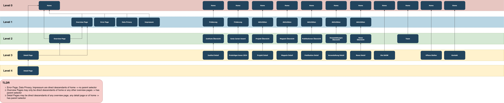

# Navigation Structure

The navigation structure builds the basis to build breadrcumbs and urls.

## Rules

1. Error Page, Data Privacy, Impressum are direct descendants of home -> no parent selector
2. Overview Pages may only be direct descendants of home or any other overview pages -> has parent selector
3. Detail Pages may be direct descendants of any overview page, any detail page or of home -> has parent selector

